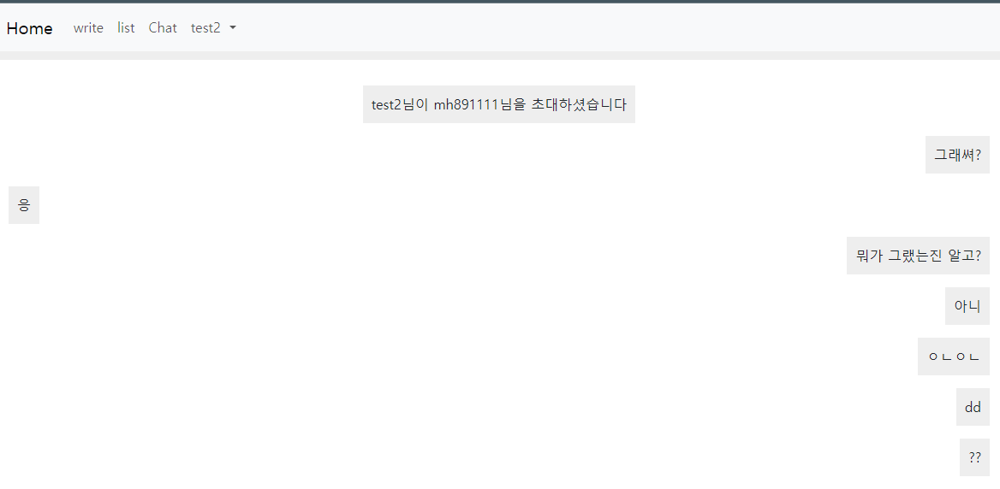

# server_prac
NodeJS, Express, Bootstrap, MongoDB Web Application Project 👻
1. It has a bulletin board where you can post a text with any image
- ToastUI Editor were used to make your content elaborate
- Your post will be added in the collection with your image
    >Text will be stored in the MongoDB and the image will be stored in MongoDB only a URL, but the actual image goes to AWS S3 bucket
2. It has a Chatting feature that you can chat with an user whom you can find on any post.
-  
  Click "채팅하기" to invite the poster to chat
  
  Have chat with the user you invited or the one who invited you 😎
3. Server-Sent-Event(SSE) to get notification when you got a chat
- 
  You will be notified with a bootstrap "Live" element which describe the text message you got and who sent the text
4. I'm planning following features
- Send image when you chat
- Separate the website depends on Languages(Eng/Kor)
- Using external APIs with CORS allowance
- Terminate user session when the user close the browser tab